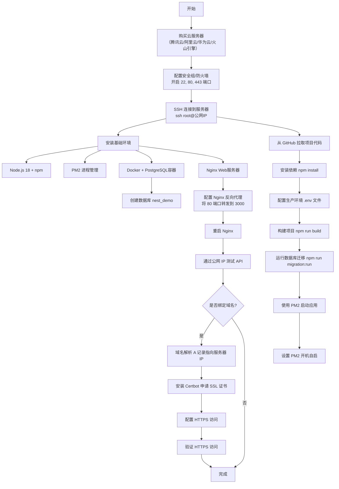

# 第八天学习总结：Nest.js 项目部署到云服务器

## 一、学习流程图



## 1.1 核心组件说明

### Node.js（JavaScript 运行时）
**作用**：让 JavaScript 代码可以在服务器端运行
- NestJS 应用是用 TypeScript/JavaScript 编写的，需要 Node.js 来执行
- npm 是 Node.js 的包管理工具，用于安装项目依赖
- 类比：就像 Java 需要 JRE/JDK，Python 需要 Python 解释器

### PM2（进程管理器）
**作用**：守护 Node.js 应用，保证应用持续稳定运行
- **自动重启**：应用崩溃时自动重启
- **日志管理**：统一收集应用的输出日志
- **开机自启**：服务器重启后自动启动应用
- **负载均衡**：可以启动多个应用实例，充分利用多核 CPU
- 类比：就像 Windows 的服务管理器，或 Linux 的 systemd 服务

**为什么不直接用 `node dist/src/main.js`？**
- 直接运行：SSH 断开连接后应用就停止了
- PM2 运行：后台持续运行，不受 SSH 断开影响

### PostgreSQL（关系型数据库）
**作用**：持久化存储应用数据
- 存储用户信息、任务数据等
- 支持复杂查询、事务、关系约束
- NestJS 通过 TypeORM 连接数据库进行 CRUD 操作
- 类比：就像 MySQL、Oracle、SQL Server

**为什么需要数据库？**
- 应用内存中的数据会在重启后丢失
- 数据库可以持久化保存数据，并支持高效查询

### Nginx（Web 服务器和反向代理）
**作用**：作为反向代理，将外网请求转发到后端应用
- **反向代理**：浏览器访问 80 端口 → Nginx 转发到 3000 端口（NestJS 应用）
- **负载均衡**：可以将请求分发到多个应用实例
- **静态文件服务**：高效处理图片、CSS、JS 等静态资源
- **HTTPS 终止**：处理 SSL 证书，加密外网流量
- **一个端口运行多个应用**：通过不同域名或路径分发请求

**为什么不直接访问 NestJS 的 3000 端口？**
- 安全性：3000 端口不对外开放，只有 Nginx 可以访问
- 标准化：用户习惯访问 80（HTTP）和 443（HTTPS）端口
- 功能丰富：Nginx 提供缓存、压缩、限流等高级功能
- 一机多用：一台服务器可以同时运行多个应用

**请求流程**：
```
用户浏览器 → http://你的IP:80 
    ↓
Nginx 反向代理（监听80端口）
    ↓
http://localhost:3000 
    ↓
NestJS 应用（PM2守护）
    ↓
PostgreSQL 数据库
```

### Docker（容器化平台，可选）
**作用**：将应用及其依赖打包成容器，实现环境隔离
- **隔离性**：每个容器有独立的文件系统和网络
- **一致性**：开发环境和生产环境完全一致
- **轻量级**：比虚拟机更快、更省资源
- 在本教程中用于运行 PostgreSQL 数据库

**为什么用 Docker 运行数据库？**
- 简化安装：一条命令启动数据库，无需复杂配置
- 数据持久化：通过卷（volume）保存数据
- 易于迁移：整个数据库可以打包迁移到其他服务器

**注意**：也可以直接安装 PostgreSQL，不使用 Docker

## 二、核心知识点

### 1. 云服务器选购与基础配置
- **厂商选择**：腾讯云。
- **操作系统**：推荐 **Ubuntu 22.04 LTS** 或 **24.04 LTS**（兼容性好，社区活跃）。
- **安全组（防火墙）**：必须放行以下端口：
  - `22`：SSH 远程登录
  - `80`：HTTP 访问
  - `443`：HTTPS 访问
  - `5432`（PostgreSQL）：**不建议对公网开放**，仅允许 localhost 访问。
- **连接服务器**：`ssh root@你的公网IP`（使用密码或密钥）。

### 2. 服务器环境搭建

#### 2.1 Node.js 18 LTS
```bash
curl -fsSL https://deb.nodesource.com/setup_18.x | sudo -E bash -
sudo apt install -y nodejs
node -v   # 验证
```

#### 2.2 PM2（进程守护）
```bash
sudo npm install -g pm2
pm2 start dist/main.js --name nest-app   # 启动应用
pm2 list                                 # 查看进程
pm2 logs nest-app                        # 查看日志
pm2 startup                              # 生成开机自启命令
pm2 save                                 # 保存当前进程列表
```

#### 2.3 Docker 与 PostgreSQL 容器
```bash
# 安装 Docker
sudo apt install -y docker.io
sudo systemctl start docker
sudo systemctl enable docker

# 运行 PostgreSQL 容器（注意设置用户名和密码）
sudo docker run --name my-postgres \
  -e POSTGRES_USER=postgres \
  -e POSTGRES_PASSWORD=你的密码 \
  -p 5432:5432 \
  -v postgres_data:/var/lib/postgresql/data \
  -d postgres:15

# 创建数据库
sudo docker exec -it my-postgres psql -U postgres -c "CREATE DATABASE nest_demo;"
```

#### 2.4 Nginx 反向代理
- **安装**：`sudo apt install -y nginx`
- **配置文件**：`/etc/nginx/sites-available/default`
- **关键配置**：
```nginx
server {
    listen 80;
    server_name _;   # 暂时用下划线，绑定域名后改为域名

    location / {
        proxy_pass http://localhost:3000;
        proxy_http_version 1.1;
        proxy_set_header Upgrade $http_upgrade;
        proxy_set_header Connection 'upgrade';
        proxy_set_header Host $host;
        proxy_set_header X-Real-IP $remote_addr;
        proxy_set_header X-Forwarded-For $proxy_add_x_forwarded_for;
        proxy_cache_bypass $http_upgrade;
    }
}
```
- **常用命令**：
```bash
sudo nginx -t              # 测试配置是否正确
sudo systemctl restart nginx
sudo systemctl status nginx
```

### 3. Nest.js 项目部署流程

1. **克隆代码**  
   `git clone https://github.com/你的用户名/nestjs-learning.git`

2. **安装依赖**  
   `npm install`

3. **配置生产环境变量**（创建 `.env` 文件）  
   ```env
   JWT_SECRET=your-strong-secret-key
   DB_HOST=localhost
   DB_PORT=5432
   DB_USERNAME=postgres
   DB_PASSWORD=你的密码
   DB_DATABASE=nest_demo
   ```

4. **构建项目**  
   `npm run build`

5. **运行数据库迁移**（生产环境关闭 `synchronize`，使用迁移）  
   `npm run migration:run`

6. **用 PM2 启动**  
   `pm2 start dist/main.js --name nest-app`

7. **设置 PM2 开机自启**  
   `pm2 startup` → 执行输出的命令 → `pm2 save`

### 4. 域名与 HTTPS（可选但推荐）

- **域名解析**：在域名服务商控制台添加 **A 记录**，将域名指向服务器公网 IP。
- **获取 SSL 证书**（Let's Encrypt + Certbot）：
  ```bash
  sudo apt install certbot python3-certbot-nginx
  sudo certbot --nginx -d yourdomain.com -d www.yourdomain.com
  ```
- Certbot 会自动修改 Nginx 配置、启用 HTTPS，并设置自动续期。

### 5. 常见故障排查表

| 错误现象 | 可能原因 | 解决方案 |
|----------|----------|----------|
| SSH 连接超时 | 未开放 22 端口或防火墙阻挡 | 云控制台安全组添加入站规则：TCP 22 |
| `502 Bad Gateway` | Nest 应用未运行或端口不匹配 | `pm2 list` 确认状态；检查 `proxy_pass` 端口（默认 3000） |
| 数据库认证失败 | `.env` 中的用户名/密码与容器不一致 | 查看容器环境变量：`docker inspect my-postgres \| grep POSTGRES_USER` |
| `role "postgres" does not exist` | 创建容器时指定了其他用户名 | 使用实际用户名登录，或重建容器时明确 `-e POSTGRES_USER=postgres` |
| 表结构同步错误 / `enum` 类型不存在 | 迁移未运行或迁移文件不完整 | 执行 `npm run migration:run`；必要时删除数据库重新迁移 |
| 公网 IP 无法访问 80 端口 | Nginx 未启动或安全组未放行 | `systemctl status nginx`；检查云控制台 80 端口是否开放 |
| `npm install` 安装非常慢 | 使用了国外源或网络慢 | 切换淘宝镜像：`npm config set registry https://registry.npmmirror.com` |
| `ENOTEMPTY: directory not empty` 错误 | npm install 被中断或文件被占用 | 删除 node_modules 和 package-lock.json，清理缓存后重装：`rm -rf node_modules package-lock.json && npm cache clean --force && npm install` |
| `crypto is not defined` 错误 | TypeScript 编译配置问题导致 crypto 模块未正确导入 | 在 `app.module.ts` 开头添加 crypto polyfill（见下方代码示例） |
| `password authentication failed for user` | PostgreSQL 用户不存在或密码错误 | 创建数据库用户：`sudo -u postgres psql -c "CREATE USER lisiyuan04 WITH PASSWORD '123456';"` |
| `type "tasks_status_enum" does not exist` | 迁移文件中缺少枚举类型创建语句 | 在迁移文件的 `up` 方法开头添加：`CREATE TYPE "public"."tasks_status_enum" AS ENUM(...)` |
| PM2 启动应用 `errored` 状态 | 缺少 `.env` 文件或数据库连接失败 | 检查 `.env` 配置；查看详细日志：`pm2 logs nest-app --lines 100` |
| Git pull 失败：`GnuTLS recv error` | GitHub 连接超时或网络不稳定 | 1. 重试几次 2. 切换到 SSH：`git remote set-url origin git@github.com:用户名/仓库.git` 3. 或使用 scp 直接复制文件 |

### 6. 部署后的验证清单

- [ ] 通过公网 IP 访问，看到 Nest.js 默认或自定义的响应。
- [ ] 注册用户接口 `POST /users` 正常工作。
- [ ] 登录接口 `POST /auth/login` 返回 `access_token`。
- [ ] 携带 token 访问受保护路由（如 `GET /users/profile`）成功。
- [ ] 任务模块 CRUD 分页功能正常。
- [ ] （若有域名）HTTPS 访问显示安全锁图标。

## 三、重要代码修复

### 3.1 修复 crypto 未定义错误

**问题**：生产环境编译后，`@nestjs/typeorm` 报错 `crypto is not defined`

**解决方案**：在 `src/app.module.ts` 开头添加 crypto polyfill：

```typescript
import { Module } from '@nestjs/common';
import { AppController } from './app.controller';
import { AppService } from './app.service';
import { TypeOrmModule } from '@nestjs/typeorm';
import { ConfigModule, ConfigService } from '@nestjs/config';
// 其他导入...

// 修复 crypto 未定义问题
import * as crypto from 'crypto';
if (typeof globalThis.crypto === 'undefined') {
  (globalThis as any).crypto = crypto;
}

@Module({
  // ... 模块配置
})
export class AppModule {}
```

**同时修改 `tsconfig.json`**：

```json
{
  "compilerOptions": {
    "module": "commonjs",  // 从 "nodenext" 改为 "commonjs"
    "target": "ES2021",    // 从 "ES2023" 改为 "ES2021"
    // 删除以下两行：
    // "moduleResolution": "nodenext",
    // "resolvePackageJsonExports": true,
    // ... 其他配置保持不变
  }
}
```

### 3.2 修复数据库迁移中的枚举类型错误

**问题**：运行迁移时报错 `type "tasks_status_enum" does not exist`

**解决方案**：在迁移文件中添加枚举类型创建语句

**文件**：`src/database/migrations/xxxx-InitialSchema.ts`

```typescript
export class InitialSchema1776871011964 implements MigrationInterface {
    public async up(queryRunner: QueryRunner): Promise<void> {
        // 先创建枚举类型
        await queryRunner.query(`CREATE TYPE "public"."tasks_status_enum" AS ENUM('pending', 'in-progress', 'completed')`);
        
        // 然后创建表
        await queryRunner.query(`CREATE TABLE "tasks" (...)`);
        await queryRunner.query(`CREATE TABLE "users" (...)`);
        await queryRunner.query(`ALTER TABLE "tasks" ADD CONSTRAINT ...`);
    }

    public async down(queryRunner: QueryRunner): Promise<void> {
        await queryRunner.query(`ALTER TABLE "tasks" DROP CONSTRAINT ...`);
        await queryRunner.query(`DROP TABLE "users"`);
        await queryRunner.query(`DROP TABLE "tasks"`);
        // 删除枚举类型
        await queryRunner.query(`DROP TYPE "public"."tasks_status_enum"`);
    }
}
```

**重新运行迁移**：

```bash
# 清理数据库
psql -U lisiyuan04 -d nest_demo -c "DROP TABLE IF EXISTS tasks CASCADE; DROP TABLE IF EXISTS users CASCADE; DROP TYPE IF EXISTS tasks_status_enum;"

# 清理迁移记录
psql -U lisiyuan04 -d nest_demo -c "DELETE FROM migrations;"

# 重新运行迁移
npm run migration:run
```

### 3.3 常用的 Linux 编辑器操作

**nano 编辑器**（服务器上常用）：
- 打开文件：`nano 文件名`
- 保存：`Ctrl + O` → `Enter`
- 退出：`Ctrl + X`
- 搜索：`Ctrl + W`
- 剪切行：`Ctrl + K`
- 粘贴：`Ctrl + U`

**psql 命令行**：
- 退出：`\q`
- 列出所有数据库：`\l`
- 列出当前数据库的表：`\dt`
- 查看表结构：`\d 表名`
- 切换数据库：`\c 数据库名`
- 列出用户：`\du`

### 3.4 数据迁移与数据导入

**注意**：数据库迁移（Migration）只迁移**表结构**，不迁移**数据**。

**如果需要迁移数据**：

```bash
# 在本地导出数据
pg_dump -U lisiyuan04 -d nest_demo --data-only --inserts -f data.sql

# 上传到服务器
scp data.sql ubuntu@服务器IP:~/projects/nestjs-learning/

# 在服务器上导入
psql -U lisiyuan04 -d nest_demo < data.sql
```

**或通过 API 创建测试数据**：

```bash
curl -X POST http://服务器IP/users/register \
  -H "Content-Type: application/json" \
  -d '{"username":"admin","email":"admin@example.com","password":"admin123","name":"Admin User","age":30}'
```

## 四、完整部署流程总结

### 步骤 1：服务器环境准备

```bash
# 1. 连接服务器
ssh ubuntu@你的服务器IP

# 2. 更新系统
sudo apt update && sudo apt upgrade -y

# 3. 安装 Node.js 18
curl -fsSL https://deb.nodesource.com/setup_18.x | sudo -E bash -
sudo apt install -y nodejs
node -v  # 验证

# 4. 安装 PM2
sudo npm install -g pm2

# 5. 安装 PostgreSQL（如果需要）
sudo apt install postgresql postgresql-contrib -y
sudo systemctl start postgresql
sudo systemctl enable postgresql

# 6. 安装 Nginx
sudo apt install -y nginx
sudo systemctl start nginx
sudo systemctl enable nginx
```

### 步骤 2：配置数据库

```bash
# 创建数据库用户和数据库
sudo -u postgres psql -c "CREATE USER lisiyuan04 WITH PASSWORD '123456lsy';"
sudo -u postgres psql -c "CREATE DATABASE nest_demo OWNER lisiyuan04;"
sudo -u postgres psql -c "GRANT ALL PRIVILEGES ON DATABASE nest_demo TO lisiyuan04;"

# 测试连接
psql -U lisiyuan04 -d nest_demo -c "SELECT 1;"
```

### 步骤 3：拉取代码并配置

```bash
# 1. 克隆项目
cd ~
mkdir -p projects
cd projects
git clone https://github.com/你的用户名/nestjs-learning.git
cd nestjs-learning

# 2. 切换 npm 镜像源（如果速度慢）
npm config set registry https://registry.npmmirror.com

# 3. 安装依赖
rm -rf node_modules package-lock.json  # 清理可能的残留
npm install

# 4. 创建 .env 文件
nano .env
```

**.env 文件内容**：

```env
JWT_SECRET=your-super-secret-key-change-this-in-production

DB_HOST=localhost
DB_PORT=5432
DB_USERNAME=lisiyuan04
DB_PASSWORD=123456lsy
DB_DATABASE=nest_demo
```

### 步骤 4：修复代码问题（重要）

```bash
# 1. 修改 tsconfig.json
nano tsconfig.json
# 将 "module": "nodenext" 改为 "module": "commonjs"
# 将 "target": "ES2023" 改为 "target": "ES2021"
# 删除 "moduleResolution": "nodenext" 和 "resolvePackageJsonExports": true

# 2. 修改 src/app.module.ts
nano src/app.module.ts
# 在导入语句后添加：
# import * as crypto from 'crypto';
# if (typeof globalThis.crypto === 'undefined') {
#   (globalThis as any).crypto = crypto;
# }

# 3. 修改迁移文件（如果需要）
nano src/database/migrations/xxxx-InitialSchema.ts
# 在 up 方法开头添加枚举创建语句
# 在 down 方法结尾添加枚举删除语句
```

### 步骤 5：编译和迁移

```bash
# 1. 删除旧的编译文件
rm -rf dist/

# 2. 编译项目
npm run build

# 3. 运行数据库迁移
npm run migration:run

# 4. 测试启动（验证是否正常）
node dist/src/main.js
# 看到 "Nest application successfully started" 后按 Ctrl+C 停止
```

### 步骤 6：使用 PM2 启动

```bash
# 1. 启动应用
pm2 start dist/src/main.js --name nest-app

# 2. 查看状态
pm2 status

# 3. 查看日志
pm2 logs nest-app

# 4. 设置开机自启
pm2 startup
# 执行输出的命令（通常是 sudo 开头的命令）
pm2 save
```

### 步骤 7：配置 Nginx 反向代理

```bash
# 1. 编辑 Nginx 配置
sudo nano /etc/nginx/sites-available/default
```

**配置内容**：

```nginx
server {
    listen 80;
    server_name _;  # 或者你的域名

    location / {
        proxy_pass http://localhost:3000;
        proxy_http_version 1.1;
        proxy_set_header Upgrade $http_upgrade;
        proxy_set_header Connection 'upgrade';
        proxy_set_header Host $host;
        proxy_set_header X-Real-IP $remote_addr;
        proxy_set_header X-Forwarded-For $proxy_add_x_forwarded_for;
        proxy_cache_bypass $http_upgrade;
    }
}
```

```bash
# 2. 测试配置
sudo nginx -t

# 3. 重启 Nginx
sudo systemctl restart nginx

# 4. 查看状态
sudo systemctl status nginx
```

### 步骤 8：测试访问

```bash
# 在服务器上测试
curl http://localhost:3000
curl http://localhost:3000/users

# 在本地浏览器访问
# http://你的服务器IP/
# http://你的服务器IP/users
```

### 步骤 9：常用维护命令

```bash
# PM2 相关
pm2 list                    # 查看所有进程
pm2 logs nest-app           # 查看日志
pm2 restart nest-app        # 重启应用
pm2 stop nest-app           # 停止应用
pm2 delete nest-app         # 删除应用

# 代码更新流程
cd ~/projects/nestjs-learning
git pull                    # 拉取最新代码
npm install                 # 安装新依赖
npm run build               # 重新编译
pm2 restart nest-app        # 重启应用

# 数据库相关
psql -U lisiyuan04 -d nest_demo -c "SELECT * FROM users;"  # 查询数据
psql -U lisiyuan04 -d nest_demo -c "\dt"                   # 查看所有表

# Nginx 相关
sudo nginx -t                        # 测试配置
sudo systemctl restart nginx         # 重启
sudo tail -f /var/log/nginx/error.log  # 查看错误日志
```

## 五、总结

第八天的学习使得一个本地开发的 Nest.js 应用成功运行在云服务器上，实现了：
- 掌握 Linux 基础命令与环境搭建
- 理解反向代理、进程守护、数据库部署的实际应用
- 解决了 npm 安装慢、crypto 模块未定义、枚举类型不存在等常见部署问题
- 具备将全栈项目部署上线、绑定域名并启用 HTTPS 的能力

**关键要点**：
- 数据库迁移只迁移表结构，不迁移数据
- 生产环境需要修改 TypeScript 编译配置和添加 crypto polyfill
- PM2 正确的启动路径是 `dist/src/main.js` 而不是 `dist/main.js`
- 通过 Nginx 反向代理可以实现多个应用共享 80/443 端口

