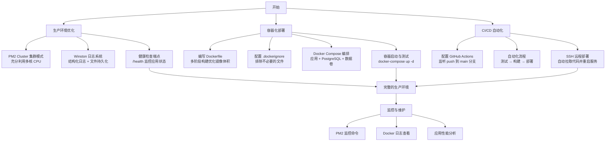
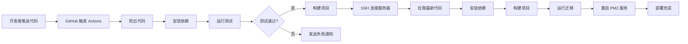

# 第九天学习总结：生产环境进阶与自动化部署

## 今日完成
- [x] PM2 cluster 模式（ecosystem.config.js 在服务器项目根目录）
- [x] 生产级 Dockerfile + .dockerignore
- [x] Docker Compose 编排应用+PostgreSQL
- [x] Winston 结构化日志（文件+控制台）
- [x] PM2 日志轮转
- [x] 健康检查端点
- [x] GitHub Actions 自动部署

## 一、学习流程图



## 二、核心知识点

### 1. PM2 Cluster 集群模式

#### 1.1 什么是 Cluster 模式？

**作用**：利用多核 CPU，启动多个应用实例，提升吞吐量和可用性。

- **单实例模式（fork）**：只启动一个进程，只能利用单核 CPU
- **集群模式（cluster）**：启动多个进程（通常为 CPU 核心数），自动负载均衡

**优势**：
- 充分利用服务器硬件资源（4 核 CPU 可启动 4 个实例）
- 单个实例崩溃时，其他实例继续服务，提高可用性
- PM2 自动实现负载均衡，无需额外配置

#### 1.2 ecosystem.config.js 配置文件

**文件位置**：项目根目录

```javascript
module.exports = {
  apps: [
    {
      name: 'nest-app',              // 应用名称
      script: './dist/src/main.js',  // 入口文件
      instances: 'max',              // 启动实例数：'max' = CPU 核心数
      exec_mode: 'cluster',          // 集群模式
      env: {
        NODE_ENV: 'production',      // 环境变量
        PORT: 3000,
      },
      error_file: './logs/pm2-error.log',     // 错误日志
      out_file: './logs/pm2-out.log',         // 输出日志
      log_date_format: 'YYYY-MM-DD HH:mm:ss', // 日志时间格式
      merge_logs: true,                       // 合并日志
      max_memory_restart: '500M',             // 内存超过 500M 自动重启
    },
  ],
};
```

**关键配置说明**：
- `instances: 'max'`：自动检测 CPU 核心数并启动相同数量的实例
- `instances: 2`：手动指定启动 2 个实例
- `exec_mode: 'cluster'`：集群模式，fork 为单实例模式
- `max_memory_restart`：防止内存泄漏，超过限制自动重启

#### 1.3 PM2 常用命令

```bash
# 使用配置文件启动
pm2 start ecosystem.config.js

# 查看所有进程（会显示多个实例）
pm2 list

# 查看详细信息（CPU、内存占用）
pm2 monit

# 重启所有实例（零停机时间）
pm2 reload nest-app

# 扩容/缩容实例数
pm2 scale nest-app 4        # 调整为 4 个实例

# 查看日志
pm2 logs nest-app

# 日志轮转配置（防止日志文件过大）
pm2 install pm2-logrotate
pm2 set pm2-logrotate:max_size 10M        # 单个日志文件最大 10M
pm2 set pm2-logrotate:retain 7            # 保留最近 7 天的日志
pm2 set pm2-logrotate:compress true       # 压缩旧日志
```

**零停机重启原理**：
```
pm2 reload nest-app
    ↓
1. 启动新的实例
2. 新实例就绪后，向旧实例发送关闭信号
3. 旧实例处理完当前请求后关闭
4. 全程保持至少一个实例在运行
```

### 2. Winston 日志系统

#### 2.1 为什么需要 Winston？

**问题**：Node.js 原生的 `console.log`：
- 无法区分日志级别（debug、info、warn、error）
- 无法持久化到文件
- 格式不统一，难以分析

**Winston 的优势**：
- **结构化日志**：JSON 格式，便于日志分析工具处理
- **多传输通道**：同时输出到控制台和文件
- **日志级别过滤**：生产环境只记录 error，开发环境记录所有
- **自动轮转**：配合 `winston-daily-rotate-file` 防止日志文件过大

#### 2.2 Winston 配置文件

**文件位置**：`src/logger/winston.config.ts`

```typescript
import { utilities as nestWinstonModuleUtilities } from "nest-winston";
import * as winston from "winston";

export const winstonConfig = {
    transports: [
        // 控制台输出：带颜色、易读格式
        new winston.transports.Console({
            format: winston.format.combine(
                winston.format.timestamp(),
                winston.format.ms(),
                nestWinstonModuleUtilities.format.nestLike(
                    "my-first-nest-app",
                    {
                        prettyPrint: true,
                        colors: true,
                    }
                )
            ),
        }),
        // 错误日志文件：JSON 格式，只记录 error 级别
        new winston.transports.File({
            filename: 'logs/error.log',
            format: winston.format.combine(
                winston.format.timestamp(),
                winston.format.json(),
            ),
            level: 'error',
        }),
        // 综合日志文件：JSON 格式，记录所有级别
        new winston.transports.File({
            filename: 'logs/combined.log',
            format: winston.format.combine(
                winston.format.timestamp(),
                winston.format.json(),
            ),
        }),
    ],
};
```

#### 2.3 在 NestJS 中集成 Winston

**安装依赖**：
```bash
npm install winston nest-winston
```

**修改 `src/app.module.ts`**：
```typescript
import { Module } from '@nestjs/common';
import { WinstonModule } from 'nest-winston';
import { winstonConfig } from './logger/winston.config';

@Module({
  imports: [
    WinstonModule.forRoot(winstonConfig),  // 注册 Winston 模块
    // 其他模块...
  ],
})
export class AppModule {}
```

**在代码中使用**：
```typescript
import { Inject, Injectable, LoggerService } from '@nestjs/common';
import { WINSTON_MODULE_NEST_PROVIDER } from 'nest-winston';

@Injectable()
export class UsersService {
  constructor(
    @Inject(WINSTON_MODULE_NEST_PROVIDER)
    private readonly logger: LoggerService,
  ) {}

  async createUser(data: CreateUserDto) {
    this.logger.log('Creating user', { username: data.username });
    try {
      // 创建用户逻辑...
      this.logger.log('User created successfully', { userId: user.id });
      return user;
    } catch (error) {
      this.logger.error('Failed to create user', error.stack);
      throw error;
    }
  }
}
```

**日志输出示例**：

控制台（彩色、易读）：
```
[Nest] 12345  - 2026-04-26 10:30:45   LOG [UsersService] Creating user
```

日志文件（JSON、可解析）：
```json
{
  "level": "info",
  "message": "Creating user",
  "timestamp": "2026-04-26T10:30:45.123Z",
  "context": "UsersService",
  "username": "testuser"
}
```

#### 2.4 日志查看与分析

```bash
# 实时查看所有日志
tail -f logs/combined.log

# 实时查看错误日志
tail -f logs/error.log

# 查看最近 100 行
tail -n 100 logs/combined.log

# 搜索特定关键词
grep "error" logs/combined.log

# 使用 jq 解析 JSON 日志（需要安装 jq）
cat logs/combined.log | jq '.message'

# PM2 日志
pm2 logs nest-app --lines 100
```

### 3. 健康检查端点

#### 3.1 为什么需要健康检查？

**作用**：监控应用是否正常运行，用于：
- **负载均衡器**：检测实例健康状态，自动摘除故障节点
- **监控系统**：定时探测，触发告警
- **容器编排**：Kubernetes、Docker Swarm 等用于就绪探针和存活探针

#### 3.2 实现健康检查端点

**安装依赖**：
```bash
npm install @nestjs/terminus
```

**创建健康检查模块**：

**文件**：`src/health/health.controller.ts`
```typescript
import { Controller, Get } from '@nestjs/common';
import { HealthCheckService, HealthCheck, TypeOrmHealthIndicator } from '@nestjs/terminus';

@Controller('health')
export class HealthController {
  constructor(
    private health: HealthCheckService,
    private db: TypeOrmHealthIndicator,
  ) {}

  @Get()
  @HealthCheck()
  check() {
    return this.health.check([
      // 检查数据库连接
      () => this.db.pingCheck('database'),
    ]);
  }
}
```

**注册模块**（`src/app.module.ts`）：
```typescript
import { Module } from '@nestjs/common';
import { TerminusModule } from '@nestjs/terminus';
import { HealthController } from './health/health.controller';

@Module({
  imports: [
    TerminusModule,  // 健康检查模块
    // 其他模块...
  ],
  controllers: [HealthController],
})
export class AppModule {}
```

#### 3.3 测试健康检查

```bash
# 本地测试
curl http://localhost:3000/health

# 返回结果（健康）
{
  "status": "ok",
  "info": {
    "database": {
      "status": "up"
    }
  },
  "error": {},
  "details": {
    "database": {
      "status": "up"
    }
  }
}

# 返回结果（不健康）
{
  "status": "error",
  "info": {},
  "error": {
    "database": {
      "status": "down",
      "message": "connection timeout"
    }
  },
  "details": {
    "database": {
      "status": "down",
      "message": "connection timeout"
    }
  }
}
```

**配置监控脚本**：
```bash
# 使用 cron 定时检查
*/5 * * * * curl -f http://localhost:3000/health || echo "App is down!" | mail -s "Alert" admin@example.com
```

### 4. Docker 容器化部署

#### 4.1 为什么使用 Docker？

**优势**：
- **环境一致性**：本地、测试、生产环境完全一致，消除"在我机器上能跑"的问题
- **简化部署**：一条命令启动整个应用栈（应用 + 数据库 + Redis...）
- **资源隔离**：每个容器有独立的文件系统和网络
- **快速扩展**：秒级启动新容器实例

#### 4.2 Dockerfile（生产级配置）

**文件位置**：项目根目录 `Dockerfile`

```dockerfile
# ========== 构建阶段 ==========
FROM node:18-alpine AS builder

WORKDIR /app

# 只复制依赖相关文件，利用 Docker 缓存层
COPY package*.json ./

# 安装所有依赖（包括 devDependencies）
RUN npm ci

# 复制源代码
COPY . .

# 构建生产版本
RUN npm run build

# ========== 生产阶段 ==========
FROM node:18-alpine

WORKDIR /app

# 只复制生产依赖
COPY package*.json ./
RUN npm ci --only=production && npm cache clean --force

# 从构建阶段复制编译后的代码
COPY --from=builder /app/dist ./dist

# 创建日志目录
RUN mkdir -p logs

# 使用非 root 用户运行（安全最佳实践）
RUN addgroup -g 1001 -S nodejs && adduser -S nestjs -u 1001
USER nestjs

# 暴露端口
EXPOSE 3000

# 启动应用
CMD ["node", "dist/src/main.js"]
```

**关键技术说明**：

1. **多阶段构建**（Multi-stage Build）
   - 第一阶段：包含完整的开发工具链，用于编译 TypeScript
   - 第二阶段：只包含生产依赖和编译后的代码
   - 优势：最终镜像体积小（~150MB vs ~1GB）

2. **依赖缓存优化**
   - 先复制 `package.json`，再复制源代码
   - 代码修改时，不会重新安装依赖（利用 Docker 缓存层）

3. **安全最佳实践**
   - 使用 `alpine` 轻量级基础镜像
   - 创建非 root 用户运行应用
   - 最小化镜像攻击面

#### 4.3 .dockerignore 文件

**文件位置**：项目根目录 `.dockerignore`

```
node_modules
dist
logs
*.log
.git
.env
.env.local
.vscode
.idea
coverage
test
*.md
Dockerfile
docker-compose.yml
```

**作用**：排除不必要的文件，减小构建上下文，加快构建速度。

#### 4.4 docker-compose.yml（应用编排）

**文件位置**：项目根目录 `docker-compose.yml`

```yaml
version: '3.8'

services:
  # PostgreSQL 数据库
  postgres:
    image: postgres:15-alpine
    container_name: nest-postgres
    restart: always
    environment:
      POSTGRES_USER: postgres
      POSTGRES_PASSWORD: your_password
      POSTGRES_DB: nest_demo
    ports:
      - "5432:5432"
    volumes:
      - postgres_data:/var/lib/postgresql/data  # 数据持久化
    networks:
      - nest-network

  # Nest.js 应用
  app:
    build:
      context: .
      dockerfile: Dockerfile
    container_name: nest-app
    restart: always
    ports:
      - "3001:3000"
    environment:
      NODE_ENV: production
      DB_HOST: postgres        # 使用服务名作为主机名
      DB_PORT: 5432
      DB_USERNAME: postgres
      DB_PASSWORD: your_password
      DB_DATABASE: nest_demo
      JWT_SECRET: your-secret-key
    depends_on:
      - postgres               # 确保数据库先启动
    volumes:
      - ./logs:/app/logs       # 日志持久化到宿主机
    networks:
      - nest-network

# 数据卷定义
volumes:
  postgres_data:

# 网络定义
networks:
  nest-network:
    driver: bridge
```

**关键配置说明**：

- `depends_on`：确保数据库先启动（但不等待数据库完全就绪）
- `restart: always`：容器崩溃时自动重启
- `volumes`：数据持久化，容器删除后数据不丢失
- `networks`：容器间通过服务名通信（如 `postgres:5432`）

#### 4.5 Docker 部署流程

**第一次部署**：
```bash
# 1. 创建环境变量文件
cat > .env.docker << EOF
JWT_SECRET=your-super-secret-key
DB_PASSWORD=your_password
EOF

# 2. 构建并启动
docker-compose up -d --build

# 3. 查看日志
docker-compose logs -f app

# 4. 运行数据库迁移
docker-compose exec app npm run migration:run

# 5. 测试访问
curl http://localhost:3000/health
```

**后续更新代码**：
```bash
# 1. 拉取最新代码
git pull

# 2. 重新构建并重启
docker-compose up -d --build

# 3. 查看新容器状态
docker-compose ps
```

**常用 Docker 命令**：
```bash
# 查看运行中的容器
docker-compose ps

# 查看日志
docker-compose logs app         # 应用日志
docker-compose logs postgres    # 数据库日志
docker-compose logs -f          # 实时查看所有日志

# 进入容器
docker-compose exec app sh      # 进入应用容器
docker-compose exec postgres psql -U postgres -d nest_demo  # 进入数据库

# 停止服务
docker-compose stop

# 停止并删除容器（数据不会丢失）
docker-compose down

# 停止并删除容器和数据卷（慎用！）
docker-compose down -v

# 查看资源占用
docker stats
```

### 5. GitHub Actions 自动化部署

#### 5.1 什么是 CI/CD？

**CI（Continuous Integration）持续集成**：
- 代码提交后自动运行测试
- 自动构建应用
- 及早发现代码问题

**CD（Continuous Deployment）持续部署**：
- 测试通过后自动部署到服务器
- 减少人工操作，避免人为错误
- 快速迭代，快速交付

#### 5.2 GitHub Actions 工作流程



#### 5.3 GitHub Actions 配置文件

**文件位置**：`.github/workflows/deploy.yml`

```yaml
name: Deploy to Production

# 触发条件：推送到 main 分支
on:
  push:
    branches: [main]

jobs:
  deploy:
    runs-on: ubuntu-latest

    steps:
      # 1. 检出代码
      - name: Checkout code
        uses: actions/checkout@v3

      # 2. 设置 Node.js 环境
      - name: Setup Node.js
        uses: actions/setup-node@v3
        with:
          node-version: '18'

      # 3. 安装依赖
      - name: Install dependencies
        run: npm ci

      # 4. 运行测试
      - name: Run tests
        run: npm test

      # 5. 构建项目
      - name: Build project
        run: npm run build

      # 6. SSH 部署到服务器
      - name: Deploy to server
        uses: appleboy/ssh-action@master
        with:
          host: ${{ secrets.SERVER_HOST }}      # 服务器 IP
          username: ${{ secrets.SERVER_USER }}  # SSH 用户名
          key: ${{ secrets.SSH_PRIVATE_KEY }}   # SSH 私钥
          script: |
            cd /var/www/nestjs-learning
            git pull origin main
            npm install
            npm run build
            npm run migration:run
            pm2 reload ecosystem.config.js
            pm2 save
```

#### 5.4 配置 GitHub Secrets

**在 GitHub 仓库中设置密钥**：

1. 进入仓库 → Settings → Secrets and variables → Actions
2. 点击 "New repository secret"
3. 添加以下密钥：

| 名称 | 值 | 说明 |
|------|-----|------|
| `SERVER_HOST` | `123.45.67.89` | 服务器公网 IP |
| `SERVER_USER` | `ubuntu` | SSH 登录用户名 |
| `SSH_PRIVATE_KEY` | `-----BEGIN RSA...` | SSH 私钥内容 |

**生成 SSH 密钥对**：
```bash
# 在本地生成密钥对
ssh-keygen -t rsa -b 4096 -C "github-actions"

# 查看公钥（添加到服务器 ~/.ssh/authorized_keys）
cat ~/.ssh/id_rsa.pub

# 查看私钥（添加到 GitHub Secrets）
cat ~/.ssh/id_rsa
```

**在服务器上添加公钥**：
```bash
# SSH 连接到服务器
ssh ubuntu@你的服务器IP

# 添加公钥
mkdir -p ~/.ssh
chmod 700 ~/.ssh
nano ~/.ssh/authorized_keys
# 粘贴公钥内容
chmod 600 ~/.ssh/authorized_keys
```

#### 5.5 测试自动部署

```bash
# 本地修改代码
echo "console.log('Auto deploy test');" >> src/main.ts

# 提交并推送
git add .
git commit -m "test: auto deployment"
git push origin main

# 在 GitHub 查看 Actions 执行情况
# 仓库 → Actions → 选择最新的 workflow run
```

**查看部署日志**：
- GitHub Actions 页面会实时显示每一步的执行结果
- 如果失败，点击失败的步骤查看详细错误信息

### 6. 生产环境最佳实践总结

| 领域 | 最佳实践 | 原因 |
|------|---------|------|
| **进程管理** | 使用 PM2 Cluster 模式 | 充分利用多核 CPU，提高并发能力 |
| **日志** | 使用 Winston 结构化日志 | JSON 格式便于分析，支持日志分级和持久化 |
| **日志轮转** | PM2 logrotate 插件 | 防止日志文件无限增长占满磁盘 |
| **监控** | 实现健康检查端点 | 用于负载均衡器和监控系统探测 |
| **容器化** | 多阶段构建 Dockerfile | 减小镜像体积，提高安全性 |
| **环境变量** | 使用 .env 文件，不提交到 Git | 敏感信息不泄露 |
| **数据库** | 使用 Migration，关闭 synchronize | 生产环境表结构变更可控 |
| **自动化** | GitHub Actions CI/CD | 减少人工操作，快速交付 |
| **安全** | 容器使用非 root 用户 | 减小攻击面 |
| **备份** | 数据库定期备份 | 数据安全保障 |

## 三、关键文件位置总结

| 文件 | 路径 | 说明 |
|------|------|------|
| PM2 配置 | `ecosystem.config.js` | 集群模式配置 |
| Dockerfile | `Dockerfile` | 容器镜像构建配置 |
| Docker Compose | `docker-compose.yml` | 多容器编排配置 |
| Winston 配置 | `src/logger/winston.config.ts` | 日志系统配置 |
| 健康检查 | `src/health/health.controller.ts` | 健康检查端点 |
| GitHub Actions | `.github/workflows/deploy.yml` | 自动部署流程 |
| Docker 忽略 | `.dockerignore` | 构建时排除的文件 |
| 环境变量 | `.env` | 本地环境变量（不提交） |
| 环境变量 | `.env.docker` | Docker 环境变量（不提交） |

## 四、完整部署流程（三种方案）

### 方案一：PM2 部署（适合单服务器）

```bash
# 1. 服务器配置
ssh ubuntu@服务器IP
cd /var/www/nestjs-learning

# 2. 创建 PM2 配置文件
cat > ecosystem.config.js << 'EOF'
module.exports = {
  apps: [{
    name: 'nest-app',
    script: './dist/src/main.js',
    instances: 'max',
    exec_mode: 'cluster',
    env: {
      NODE_ENV: 'production',
      PORT: 3000,
    },
    error_file: './logs/pm2-error.log',
    out_file: './logs/pm2-out.log',
    log_date_format: 'YYYY-MM-DD HH:mm:ss',
    merge_logs: true,
    max_memory_restart: '500M',
  }],
};
EOF

# 3. 安装 PM2 日志轮转
pm2 install pm2-logrotate
pm2 set pm2-logrotate:max_size 10M
pm2 set pm2-logrotate:retain 7
pm2 set pm2-logrotate:compress true

# 4. 启动应用
pm2 start ecosystem.config.js
pm2 save
pm2 startup  # 执行输出的命令
```

### 方案二：Docker Compose 部署（推荐）

```bash
# 1. 服务器配置
ssh ubuntu@服务器IP
cd /var/www/nestjs-learning

# 2. 创建 Dockerfile（见上文）

# 3. 创建 docker-compose.yml（见上文）

# 4. 创建环境变量文件
cat > .env.docker << EOF
JWT_SECRET=your-super-secret-key
DB_PASSWORD=your_password
EOF

# 5. 构建并启动
docker-compose up -d --build

# 6. 运行数据库迁移
docker-compose exec app npm run migration:run

# 7. 查看日志
docker-compose logs -f
```

### 方案三：GitHub Actions 自动部署（最佳）

```bash
# 1. 在本地项目创建 Actions 配置（见上文）

# 2. 在 GitHub 配置 Secrets（见上文）

# 3. 推送代码触发自动部署
git add .
git commit -m "feat: setup CI/CD"
git push origin main

# 4. 在 GitHub Actions 页面查看部署进度
```

## 五、故障排查指南

| 问题 | 可能原因 | 解决方案 |
|------|---------|---------|
| PM2 启动失败 `Error: Cannot find module` | 未编译或路径错误 | 确认 `dist/src/main.js` 存在；运行 `npm run build` |
| PM2 显示 `errored` 状态 | 应用启动时抛出异常 | 查看详细日志：`pm2 logs nest-app --lines 100` |
| Docker 构建失败 `npm ci` 错误 | `package-lock.json` 版本不一致 | 删除 `package-lock.json`，运行 `npm install`，重新提交 |
| Docker 容器启动后立即退出 | 数据库连接失败或环境变量错误 | 查看日志：`docker-compose logs app` |
| `docker-compose up` 失败 `port already in use` | 端口被占用 | 停止占用端口的进程或修改 `docker-compose.yml` 端口映射 |
| 健康检查返回 503 | 数据库连接失败 | 检查数据库是否启动：`docker-compose ps` |
| GitHub Actions SSH 连接失败 | 密钥配置错误或服务器防火墙 | 确认 SSH 密钥正确；检查服务器 22 端口是否开放 |
| GitHub Actions 部署后应用未更新 | PM2 重启失败 | 登录服务器手动执行：`pm2 reload nest-app` |
| 日志文件占满磁盘 | 未配置日志轮转 | 安装 PM2 logrotate；配置 Winston 日志大小限制 |
| Cluster 模式下 Session 丢失 | 多实例间状态不共享 | 使用 Redis 存储 Session；或使用 JWT（无状态） |

## 七、监控与告警

### 7.1 PM2 监控

```bash
# 实时监控（CPU、内存、请求数）
pm2 monit

# 查看详细信息
pm2 show nest-app

# 安装 PM2 Web 监控（可选）
pm2 install pm2-server-monit
```

### 7.2 使用 PM2 Plus（官方监控平台）

```bash
# 注册 PM2 Plus 账号（https://app.pm2.io/）

# 连接到 PM2 Plus
pm2 link <secret_key> <public_key>

# 在 Web 界面查看：
# - 实时性能图表
# - 错误日志聚合
# - 自定义告警规则
```

### 7.3 日志分析工具

**推荐工具**：
- **ELK Stack**（Elasticsearch + Logstash + Kibana）：企业级日志分析
- **Grafana + Loki**：轻量级日志聚合
- **DataDog**：商业 APM 平台

**简单方案（使用 logrotate）**：
```bash
# 安装 logrotate
sudo apt install logrotate

# 创建配置文件
sudo nano /etc/logrotate.d/nest-app
```

```
/var/www/nestjs-learning/logs/*.log {
    daily               # 每天轮转
    rotate 7            # 保留 7 天
    compress            # 压缩旧日志
    delaycompress       # 延迟一天压缩
    missingok           # 文件不存在不报错
    notifempty          # 空文件不轮转
}
```

## 八、总结

第九天的学习使得应用从基础部署升级到生产级别，实现了：

### 8.1 核心成就
- **高可用性**：PM2 Cluster 模式 + 自动重启
- **可观测性**：Winston 结构化日志 + 健康检查
- **容器化**：Docker + Docker Compose 标准化部署
- **自动化**：GitHub Actions 一键部署

### 8.2 关键要点
- PM2 Cluster 模式可以充分利用多核 CPU，提升并发能力
- Winston 日志系统提供结构化日志，便于分析和告警
- Docker 多阶段构建可以大幅减小镜像体积
- GitHub Actions 实现 CI/CD，代码推送后自动测试、构建、部署

### 8.3 下一步方向
- **微服务架构**：拆分单体应用，使用 gRPC 或消息队列通信
- **Redis 缓存**：减轻数据库压力，提升响应速度
- **监控告警**：集成 Prometheus + Grafana 监控系统
- **压力测试**：使用 k6 或 Artillery 进行性能测试
- **安全加固**：添加 rate-limit、helmet、CORS 配置

### 8.4 生产环境检查清单

- [ ] PM2 使用 Cluster 模式并配置开机自启
- [ ] Winston 日志正常输出到文件
- [ ] 配置日志轮转，防止磁盘占满
- [ ] 健康检查端点正常响应
- [ ] 数据库使用 Migration 而非 synchronize
- [ ] 环境变量文件不提交到 Git
- [ ] Nginx 配置 HTTPS（Let's Encrypt）
- [ ] 配置定期数据库备份
- [ ] 设置监控告警（可选）
- [ ] 文档更新部署流程